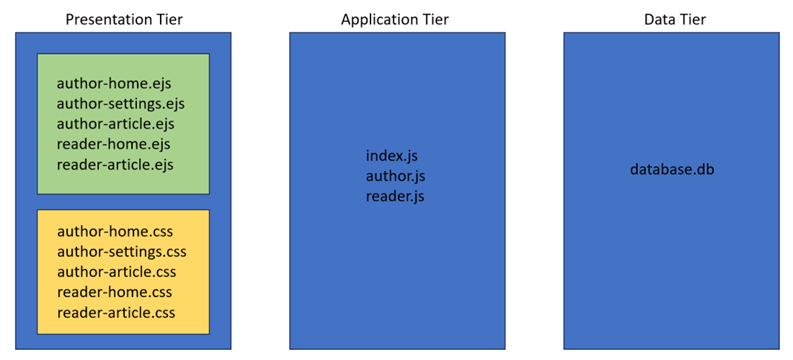

# Blogger
Daabase Networks and the Web course project (July 2023)

## Table of Contents
- [Introduction](#introduction)
- [Project Structure](#project-structure)
- [Three-tier Web Application Architecture](#three-tier-web-application-architecture)
- [routes](#routes)
- [views](#views)
- [db_schema.sql](#db_schemasql)
- [Getting Started](#getting-started)

## Introduction
Blogger is a simple blogging web application for authors and readers. Authors can create, edit and publish articles. For readers, they can browse, read, comment on and like the published articles.

## Project Structure
```
├── routes
│   ├── author.js
│   ├── reader.js
│   ├── user.js
├── styles
│   ├── author-article-edit.css
│   ├── author-home.css
│   ├── author-settings.css
│   ├── reader-article.css
│   ├── reader-home.css
├── views
│   ├── author-article-edit.ejs
│   ├── author-home.ejs
│   ├── author-settings.ejs
│   ├── create-user-record.ejs
│   ├── reader-article.ejs
│   ├── reader-home.ejs
├── .gitignore
├── README.md
├── db_schema.sql
├── index.js
├── package-lock.json
├── package.json
```

## Three-tier Web Application Architecture


## routes
### index.js
The index.js file sets up the configuration of the web application, such as creating and running the web application's database, seting the view engine and the routes of the web app. There are three main routes ```/author``` ```/reader``` ```/user``` which are defined in the javascript files below. The root route redirects the user to ```/reader/home```.

### author.js
author.js creates and defines 8 subroutes:
- ```/author/home```
- ```/author/article/create```
- ```/author/article/edit/:id?```
- ```/author/article/update/:id?```
- ```/author/article/publish/:id?```
- ```/author/article/delete/:id?```
- ```/author/settings```
- ```/author/update/:id?```

When the web app receives a ```get``` request when a user enters the ```/author/home``` route, it queries the database for the author's information and articles and passes the data to ```author-home.ejs``` for rendering the page.

### reader.js
TODO

### user.js
TODO

## db_schema.sql
TODO

## Getting Started
### Dependencies
- NodeJS

Follow installation instructions at https://nodejs.org/en/
- sqlite3

<b>Windows:</b> https://www.sqlitetutorial.net/download-install-sqlite/
<br>
<b>Mac users:</b> it comes preinstalled
<br>
<b>Linux users:</b> use a package manager eg. apt install

### Installation / Executing Program
Run the following commands to get started:
1. Clone repository from Github
```
git clone https://github.com/runningsquare/blogger.git
```
2. Install all the node packages required
```
npm install
```
3. Build the database (for Windows)
```
Get-Content db_schema.sql | sqlite3 database.db
```
3. Build the database (for macOS, Linux)
```
npm run build-db
```
4. Run the program
```
npm run start
```
5. Open the program at ```http://localhost:3000/author/home```